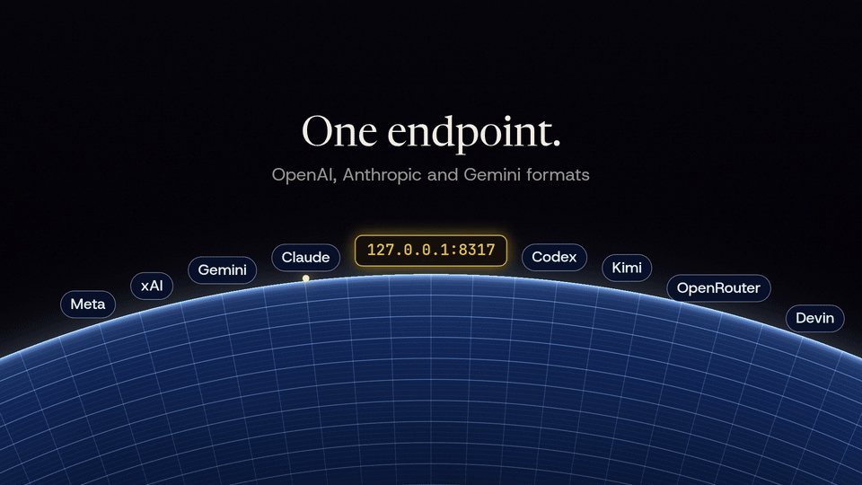

# cliproxy-rs

[](https://github.com/vayungodara/cliproxy-rs/actions/workflows/ci.yml)
[](https://github.com/vayungodara/cliproxy-rs/releases/latest)
[](https://github.com/vayungodara/homebrew-tap)

Codex CLI, Claude Code 같은 도구를 하나의 로컬 주소에 연결해 DeepSeek, GLM, Kimi, OpenRouter 또는 자체 게이트웨이를 사용합니다. 본인의 API 키나 계정으로 여러 제공자를 함께 사용하며, OpenAI, Anthropic, Gemini API(프로그램끼리 데이터를 주고받는 통로) 형식을 변환합니다.

<a id="quick-start"></a>
## 빠른 시작

1. macOS 또는 Linux에서 설치합니다.

   ```sh
   curl -fsSL https://raw.githubusercontent.com/vayungodara/cliproxy-rs/master/install.sh | sh
   ```

   Windows에서는 PowerShell을 사용합니다.

   ```powershell
   irm https://raw.githubusercontent.com/vayungodara/cliproxy-rs/master/install.ps1 | iex
   ```

   설치 스크립트는 릴리스 파일의 체크섬을 확인하고 `~/.cliproxy-rs/config.yaml`을 만든 다음 프록시를 시작하고 대시보드를 엽니다. Windows 설정 경로는 `%USERPROFILE%\.cliproxy-rs\config.yaml`입니다. 새 키는 화면에 출력하지 않고 `keys.env`에 저장합니다.

2. 설정 파일 옆의 `keys.env`에 있는 `CLIPROXY_MANAGEMENT_KEY`로 대시보드에 로그인합니다. 본인 계정을 연결하거나 제공자의 API 키를 추가합니다. 구독 계정을 연결하기 전에 [계정과 제공자 이용약관](#accounts-and-provider-terms)을 읽습니다.
3. 대시보드의 **Use with tools** 페이지에서 Codex CLI 또는 Claude Code 설정을 복사합니다. 도구에는 관리 키가 아닌 `CLIPROXY_CLIENT_KEY`를 사용합니다.

### 다른 설치 방법과 업데이트

Windows에서는 [Scoop](https://scoop.sh)도 사용할 수 있습니다. 실행 파일만 설치하므로 [설치 스크립트 없이 처음 실행하기](docs/INSTALL.md#first-run-without-the-install-script)에 따라 설정과 키를 만듭니다.

```powershell
scoop bucket add vayungodara https://github.com/vayungodara/scoop-bucket
scoop install vayungodara/cliproxy-rs
```

macOS 또는 Linux에서는 Homebrew로 설치할 수 있습니다.

```sh
brew install vayungodara/tap/cliproxy-rs
brew services start cliproxy-rs
```

설정과 `keys.env`는 `$(brew --prefix)/etc/cliproxy-rs/`에 있으며, 대시보드 주소는 `http://127.0.0.1:8317/management.html`입니다. 자세한 내용은 [Homebrew 설치 안내](docs/INSTALL.md#homebrew)를 참고합니다.

설치 명령을 다시 실행하거나 Homebrew에서 `brew upgrade cliproxy-rs`를 실행하면 업데이트됩니다. 두 방법 모두 기존 설정과 키를 보존합니다. [설치 안내](docs/INSTALL.md)는 로그인 시 자동 시작, 릴리스 실행 파일, Docker, 소스 빌드를 설명합니다. 단계별 안내는 [시작 가이드](docs/GETTING-STARTED.md)에 있습니다.

<a id="what-is-this"></a>
## 프로젝트 소개

cliproxy-rs는 [CLIProxyAPI](https://github.com/router-for-me/CLIProxyAPI)를 Rust로 다시 구현한 프로젝트입니다. 같은 `config.yaml`과 인증 파일 형식을 읽으며, 클라이언트 경로와 v8 관리 API를 구현합니다. 아직 완전히 호환되지는 않습니다. 점검 대상 1,687개 중 835개는 구현과 검증을 마쳤고 707개는 일부만 충족하며 145개는 미구현입니다. 각 분류의 기준은 [호환성 현황](docs/PARITY.md)에 있습니다.

대시보드에서 계정, 제공자 사용 한도, 요청 이력, 도구 설정을 확인합니다.

<p align="center">
  <a href="https://x.com/vayungodara/status/2106492049490899062"></a>
  <br><sub><a href="https://x.com/vayungodara/status/2106492049490899062">출시 영상 보기</a></sub>
</p>

<p align="center">
  <picture>
    <source media="(prefers-color-scheme: dark)" srcset="docs/img/overview-dark.png">
    
  </picture>
</p>

<a id="use-it-with-your-tools"></a>
## 도구 연결

OpenAI 클라이언트의 로컬 기본 주소는 `http://127.0.0.1:8317/v1`입니다. Claude Code와 Gemini 클라이언트는 `/v1` 없이 `http://127.0.0.1:8317`을 사용합니다. 실제 설치에서 사용하는 포트와 클라이언트 키를 적용합니다.

[클라이언트 설정](docs/CLIENTS.md)에는 [Claude Code에서 GPT 사용하기](docs/CLIENTS.md#gpt-in-claude-code)도 포함되어 있습니다. 모든 모델과 도구 조합을 검증한 것은 아닙니다.

<a id="api-keys-codex-cli-and-mixed-providers"></a>
## API 키로 Codex CLI와 여러 제공자 연결

구독 계정에 로그인하지 않아도 사용할 수 있습니다. 다음 제공자 설정을 `~/.cliproxy-rs/config.yaml`에 합칩니다. Windows 경로는 `%USERPROFILE%\.cliproxy-rs\config.yaml`입니다. 기존 `access.api-keys`, `management.secret-key`와 나머지 설정은 유지합니다. 저장하면 프록시가 설정을 다시 읽습니다.

아래 키는 프록시의 클라이언트 키와 별개입니다. `<...>` 부분에는 각 제공자에서 발급한 키와 실제 모델 ID를 넣습니다.

```yaml
api-keys:
  openai-compatibility:
    - name: deepseek
      base-url: "https://api.deepseek.com"
      keys:
        - api-key: "<deepseek-api-key>"
      models:
        - name: "<deepseek-model-id>"
          alias: "deepseek"
    - name: openrouter
      base-url: "https://openrouter.ai/api/v1"
      keys:
        - api-key: "<openrouter-api-key>"
      models:
        - name: "<openrouter-model-id>"
          alias: "router"
```

다음 사용량 기반 과금 API에도 같은 구조를 사용합니다. 기본 주소에는 `/chat/completions`를 넣지 않습니다. 프록시가 이 경로를 추가합니다.

| 제공자 | 기본 주소 | 모델 ID와 API 안내 |
| --- | --- | --- |
| DeepSeek | `https://api.deepseek.com` | [DeepSeek API 문서](https://api-docs.deepseek.com/) |
| GLM (Z.ai) | `https://api.z.ai/api/paas/v4` | [Z.ai API 문서](https://docs.z.ai/api-reference/introduction) |
| Kimi (Moonshot) | `https://api.moonshot.ai/v1` | [Moonshot API 문서](https://platform.moonshot.ai/docs) |
| OpenRouter | `https://openrouter.ai/api/v1` | [OpenRouter API 문서](https://openrouter.ai/docs/quickstart) |
| OpenCode Go | `https://opencode.ai/zen/go/v1` | [OpenCode Go 문서](https://opencode.ai/docs/go/). Chat Completions 모델을 사용하고 제공자 항목에 `headers: {x-opencode-session: $CPA-SESSION-ID}`를 추가합니다. 대화별 세션 ID를 보내며, 이 헤더가 없으면 OpenCode Go가 요청을 거부합니다. |

`~/.codex/config.toml`에 다음 설정을 넣습니다.

```toml
model = "deepseek"
model_provider = "cliproxy"

[model_providers.cliproxy]
name = "cliproxy-rs"
base_url = "http://127.0.0.1:8317/v1"
env_key = "CLIPROXY_CLIENT_KEY"
wire_api = "responses"
```

다음 예시의 `your-client-key`를 설치 경로의 `keys.env`에 있는 실제 `CLIPROXY_CLIENT_KEY`로 바꿉니다. 포트도 실제 설정과 맞춥니다.

```sh
export CLIPROXY_CLIENT_KEY=your-client-key
codex
```

Codex CLI는 프록시에 Responses 요청을 보내고, 프록시는 이 제공자에 맞게 Chat Completions로 변환합니다. 두 번째 제공자를 사용하려면 `model = "router"`로 바꿉니다. 다른 클라이언트도 같은 주소에서 두 별칭과 연결된 구독 계정을 함께 사용할 수 있습니다.

실패 시 다른 계정으로 전환하려면 두 제공자 항목에 같은 모델 별칭을 지정하거나 제공자의 `keys` 목록에 키를 추가합니다. 기본적으로 429 응답을 받은 인증 정보는 실패한 모델에 대해 대기 상태가 되고, 프록시는 설정된 시도 횟수와 오류 규칙 안에서 같은 별칭에 사용할 수 있는 다른 인증 정보를 시도합니다. 모두 대기 중일 때의 재시도는 [대기 시간과 한도](docs/MULTI-ACCOUNT.md#cooldowns-and-limits)를 참고합니다.

<p align="center"></p>

2026년 10월 7일에는 Codex CLI 0.160과 cliproxy-rs 0.2.2로 파일 수정과 셸 명령 실행을 완료했습니다. 위 OpenCode Go의 Chat Completions 주소에서 DeepSeek V4.1 Flash를 사용했습니다. 표의 DeepSeek, GLM, Kimi, OpenRouter 주소는 실제 서비스로 실행해 검증하지 않았습니다.

<a id="accounts-and-provider-terms"></a>
## 계정과 제공자 이용약관

이 프로젝트는 한 사람이 본인 기기에서 본인 계정을 사용하는 용도입니다. 프록시와 키는 비공개로 유지합니다. 구독 계정을 여러 사람에게 제공하는 공유 서비스가 아닙니다.

제공자가 공식적으로 허용하는 연결 방법이 있으면 그 방법을 사용합니다.

- OpenAI는 자격을 충족하는 사용자가 로컬 개인 프로젝트를 포함한 참여 도구에서 요금제를 사용할 수 있도록 [Sign in with ChatGPT](https://developers.openai.com/cookbook/articles/sign-in-with-chatgpt)를 제공합니다. 허용 범위는 연동 방식과 동의 범위에 따라 달라집니다. cliproxy-rs의 Codex 로그인은 CLIProxyAPI의 기존 로그인 흐름을 따르며, 새로운 Sign in with ChatGPT 연동은 아닙니다.
- Claude Code는 [게이트웨이 설정](https://code.claude.com/docs/en/llm-gateway-connect)을 지원합니다. 다른 모델의 API 키로 프록시를 거쳐 Claude Code에 연결할 수 있습니다. Anthropic의 [인증 규칙](https://code.claude.com/docs/en/legal-and-compliance#authentication-and-credential-use)은 Claude 구독 OAuth를 Claude Code와 Anthropic 자체 애플리케이션에 한정합니다. 타사 도구에서 Claude를 사용할 때는 API 키나 지원되는 클라우드 제공자를 사용합니다.

개인 용도라도 각 제공자의 약관이 적용됩니다. 약관을 위반하면 제공자가 계정을 제한하거나 정지할 수 있습니다. 계정을 공유하거나 다른 사람에게 서비스를 제공하는 데 사용하는 경우가 대표적입니다.

<a id="several-accounts"></a>
### 여러 계정

로그인할 때마다 `auth-dir`에 파일이 생성됩니다. 요청은 `round-robin`, `fill-first`, `weighted-round-robin` 또는 선택적으로 활성화하는 실험적 `soonest-reset` 방식으로 사용 가능한 인증 정보에 배분됩니다. 설치 스크립트는 한 대화를 같은 계정에서 이어 가도록 세션 고정을 활성화합니다. 설정을 생략하면 서버의 기본값은 비활성화입니다. 429 응답이 발생하면 같은 모델에 사용할 수 있는 다른 인증 정보로 요청을 전환할 수 있습니다. 계정 선택과 다른 기기에서의 접속은 [다중 계정 안내](docs/MULTI-ACCOUNT.md)에 있습니다.

<a id="cliproxyapi-compatibility"></a>
## CLIProxyAPI 호환성

설정과 프로토콜 테스트는 Go CLIProxyAPI의 `6fecc6e`를 기준으로 호환성을 확인합니다. 내장 대시보드는 두 서버를 대상으로 한 테스트가 있습니다. 타사 CLIProxyAPI 애플리케이션과 cliproxy-rs의 조합은 아직 검증하지 않았습니다.

전환하기 전에 [Go 버전에서 이전하기](docs/MIGRATING-FROM-GO.md), 특히 갱신 토큰 관련 주의 사항을 읽습니다. 기본 Docker 이미지는 `/data/config.yaml`을 사용하고 UID/GID 10001로 실행됩니다. 마운트와 권한을 수정하거나, 기존 경로를 유지하려면 `--config`와 접근 가능한 `oauth.auth-dir`를 지정합니다.

<a id="terminal-ui"></a>
## 터미널 관리 화면

`cliproxy -tui`는 실행 중인 서버를 관리합니다. 접속 주소는 `-management-base-url`, `management.base-url`, `http://127.0.0.1:<port>` 순서로 선택하며 관리 키를 요청합니다. `cliproxy -tui -standalone`은 같은 프로세스에서 서버를 시작하고 화면을 종료할 때 서버도 중지합니다. 독립 실행 모드에는 루프백 또는 와일드카드 `host`가 필요하며 `server.tls`는 사용할 수 없습니다.

<a id="upcoming-features"></a>
## 아직 지원하지 않는 기능

- AUR 패키지.
- 모델 라우터 없이 플러그인이 소유하는 인증 정보, 모델, 실행기. 플러그인 스케줄러, 요청·응답 변환기, thinking 적용기, `host.model.*` 콜백, WebSocket 응답 관찰 기능. 기존 플러그인은 로드, 경로와 할당량 제공, 스토어 설치가 가능하며 프런트엔드 인증, 모델 라우팅, 인터셉터, 사용량 훅에 참여할 수 있습니다.
- Home에서 관리하는 플러그인 동기화, 작업, 상태 보고. Home 사용량, 로그, 처리 중 요청 보고와 키·값 저장은 이미 동작합니다.
- Google Antigravity 계정.
- 대시보드에서 Vertex 서비스 계정 가져오기. 명령줄에서는 사용할 수 있습니다.
- `pprof` 디버그 리스너.
- [호환성 현황](docs/PARITY.md)에 나열된 나머지 미구현 항목과 Go 테스트 사례.

<a id="performance"></a>
## 성능

[Claude 장시간 부하 테스트](docs/BENCHMARKS.md#claude-soak-large-prompts-and-memory)에서 평균 306 KB 요청 3,000개를 처리한 뒤 30초 시점의 메모리는 29 MB였고, 평균 1.9 MB 요청 600개를 처리한 경우에는 43 MB였습니다. [혼합 부하 테스트](docs/BENCHMARKS.md#field-mix-claude-codex-and-count_tokens)는 4개 세션에서 평균 1 MB의 Claude, Codex, count_tokens 요청을 1시간 동안 보냈습니다. 요청 사이의 상주 메모리(RSS)는 80.6~97.6 MB, 최대치는 169.0 MB였습니다. 0.2.0에서는 각각 128.2~145.4 MB와 220.1 MB였습니다. 각 빌드는 같은 시간에 별도의 CI 실행 환경에서 측정했습니다. CI는 변경 내용을 자동으로 검사하는 절차입니다.

[32 MB 토크나이저 두 개에 관한 글](https://dev.to/vayun/two-32-mb-tokenizers-hunting-a-memory-floor-in-a-rust-proxy-4hfl)은 메모리가 일정 수준 이하로 줄지 않는 원인을 찾은 과정과 아직 설명하지 못한 부분을 다룹니다. 개인 설치 환경의 일상 사용에서는 RSS 75~101 MB가 관찰되었습니다. 이 값은 스크립트로 측정하지 않았으며, 표본 시점, 부하, 정확한 빌드 정보도 기록하지 않았습니다.

[작은 요청 벤치마크](docs/BENCHMARKS.md#setup)의 세 차례 측정에서 최초 출시 빌드의 첫 요청 응답은 15~46 ms, 같은 실행의 Go는 104~453 ms였습니다. 부하가 적은 별도 실행에서 Go는 45~98 ms였습니다. 형식 변환이 있는 스트리밍 처리량은 초당 793개였으며 Go는 564개였습니다.

비스트리밍 처리량은 Go가 초당 1,568개로 cliproxy-rs의 1,168개보다 높았습니다. 요청당 CPU 시간도 Go는 0.62 ms, cliproxy-rs는 0.85 ms였습니다. 단순 스트리밍도 Go는 초당 916개, cliproxy-rs는 833개였습니다. 느린 스트림 256개에서는 cliproxy-rs의 p99 지연(요청 99%가 이 시간 안에 완료되는 값)이 1,414.5 ms로 Go의 1,272.2 ms보다 길었습니다. 이 합성 부하 결과는 0.1.0 최초 출시 빌드의 수치입니다. 측정 방법, 원본 결과, 이후 Claude 측정은 [벤치마크 문서](docs/BENCHMARKS.md)에 있습니다.

<a id="documentation"></a>
## 문서

- [시작 가이드](docs/GETTING-STARTED.md)와 [설치 안내](docs/INSTALL.md).
- [클라이언트 설정](docs/CLIENTS.md), [다중 계정](docs/MULTI-ACCOUNT.md), [설정 항목](docs/CONFIGURATION.md).
- [CLIProxyAPI에서 이전하기](docs/MIGRATING-FROM-GO.md)와 [Go 버전과의 차이](docs/DIFFERENCES-FROM-GO.md).
- [호환성 현황](docs/PARITY.md)과 [벤치마크](docs/BENCHMARKS.md).

<a id="security"></a>
## 보안

대시보드는 실행 파일에 내장됩니다. 모델 목록은 시작 시점과 이후 3시간마다 다운로드합니다. `--local-model`로 다운로드를 비활성화합니다.

다른 기기의 접속이 필요하지 않으면 `access.api-keys`를 설정하고 `server.host`를 `127.0.0.1`로 유지합니다. 로컬 터널이나 역방향 프록시 뒤에서는 `server.trusted-proxies`를 설정합니다. 그렇지 않으면 인터넷 클라이언트를 로컬 접속으로 판단합니다. [안전한 실행 방법](docs/GETTING-STARTED.md#running-it-safely)에 설명이 있으며, 취약점 신고 방법은 [보안 정책](SECURITY.md)에 있습니다.

<a id="development"></a>
## 개발

Rust 워크스페이스는 `crates/`, Svelte 대시보드는 `ui/`에 있습니다. 테스트는 로컬 모의 제공자를 사용합니다. CI는 형식 검사, clippy, 전체 테스트와 Go·PostgreSQL 비교 테스트를 실행합니다. [비교 테스트 도구](harness/README.md)는 CLIProxyAPI와 57개 사례를 비교합니다.

```sh
cargo fmt --all --check
cargo clippy --workspace --all-targets --locked -- -D warnings
cargo test --workspace --locked
```

대시보드 소스를 수정할 때는 `ui/`에서 `npm ci`, `npm run check`, `npm test`, `npm run build`를 사용합니다. `ui/dist`는 저장소에 포함되며 Rust 빌드 시 내장되므로 대시보드를 먼저 빌드합니다. 자세한 내용은 [대시보드 개발 안내](ui/README.md)에 있습니다.

기여 방법은 [기여 안내](CONTRIBUTING.md)를 참고합니다. 개발 과정에서 AI의 도움을 일부 받았습니다.

<a id="license"></a>
## 라이선스

MIT 라이선스입니다. [LICENSE](LICENSE)를 참고합니다. CLIProxyAPI도 MIT 라이선스를 사용합니다.
