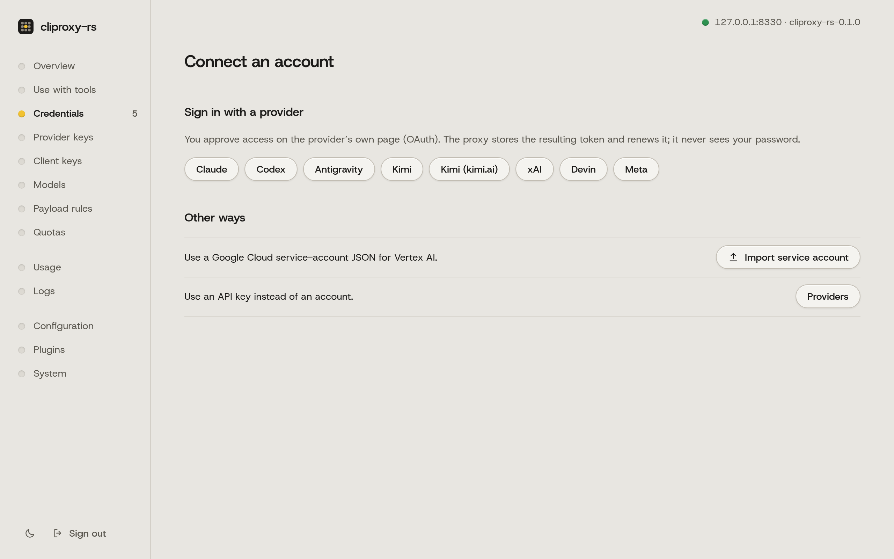

# 시작하기

> 이 문서에서 알 수 있는 것: cliproxy-rs를 설치해 켜고, 계정과 도구를 연결하는 방법.

이 문서는 코딩 도구를 내 계정이나 API 키에 cliproxy-rs로 연결하는 방법을 다룹니다. API 키를 쓰면서 여러 제공자를 섞는 Codex CLI라면 [API 키로 Codex CLI와 여러 제공자를 연결하는 방법](../README.md#api-keys-codex-cli-and-mixed-providers)부터 보십시오.

<a id="1-install-and-start-it"></a>
## 1. 설치하고 켜기

macOS나 Linux에서는 이렇게 합니다.

```sh
curl -fsSL https://raw.githubusercontent.com/alpoxdev/cliproxyapi/dev/install.sh | sh
```

Windows에서는 PowerShell에서 이렇게 합니다.

```powershell
irm https://raw.githubusercontent.com/alpoxdev/cliproxyapi/dev/install.ps1 | iex
```

스크립트는 내 컴퓨터에 맞는 릴리스를 내려받아 릴리스의 `SHA256SUMS`와 대조해 확인합니다. 그다음 `~/.cliproxy-rs/config.yaml`에 새 키 두 개를 만들고, 서버를 백그라운드에서 켠 뒤 응답하는지 확인합니다. 끝나면 이렇게 출력합니다.

```text
cliproxy-rs is running at http://127.0.0.1:8317
  Dashboard  http://127.0.0.1:8317/management.html
  Keys       /home/you/.cliproxy-rs/keys.env (show them with: cat /home/you/.cliproxy-rs/keys.env)
  Config     /home/you/.cliproxy-rs/config.yaml
  Log        /home/you/.cliproxy-rs/cliproxy.log
  Stop       kill $(cat '/home/you/.cliproxy-rs/cliproxy.pid')
```

포트는 8317입니다. 이미 쓰는 곳이 있으면(예를 들어 CLIProxyAPI) 다음으로 비어 있는 포트를 씁니다. `keys.env`에는 키가 두 개 들어 있습니다.

- `CLIPROXY_MANAGEMENT_KEY`는 대시보드에 로그인할 때 쓰는 비밀번호입니다.
- `CLIPROXY_CLIENT_KEY`는 내 도구가 프록시로 보내는 값입니다.

이 파일은 나만 읽을 수 있고, 스크립트는 키를 절대 출력하지 않습니다. 나중에 같은 명령을 다시 실행하면 업그레이드됩니다. 설정과 키는 그대로 유지됩니다. 로그인 시 자동 시작, Docker, 소스에서 빌드, 설정을 직접 쓰는 방법은 [INSTALL.md](INSTALL.md)에서 다룹니다.

<a id="2-open-the-dashboard"></a>
## 2. 대시보드 열기

스크립트가 브라우저에서 <http://127.0.0.1:8317/management.html>을 엽니다(다른 포트를 골랐다면 그 포트를 쓰십시오). `CLIPROXY_MANAGEMENT_KEY`로 로그인합니다. 브라우저가 없는 서버라면 [INSTALL.md](INSTALL.md#with-the-install-script)에 나오는 대로 내 컴퓨터에서 SSH 터널을 먼저 여십시오.

새 서버에서는 개요 화면에 세 단계짜리 짧은 시작하기 카드가 보입니다. 계정 연결하기, 도구가 프록시를 쓰도록 지정하기, 시험 요청 보내기입니다. 세 단계를 모두 마치거나 카드를 닫으면 사라집니다.

<a id="3-connect-an-account"></a>
## 3. 계정 연결하기

<picture>
  <source media="(prefers-color-scheme: dark)" srcset="img/connect-dark.png">
  
</picture>

대시보드에서 계정 연결을 고르고 제공자를 선택합니다. Claude와 ChatGPT(Codex)는 제공자의 로그인 페이지를 엽니다. Kimi, Meta, xAI, Devin은 그 사이트에 입력할 기기 코드를 보여 줍니다. 프록시는 로그인 토큰(로그인 증명서 같은 값)을 `auth-dir`에 저장합니다. 비밀번호는 절대 보지 않습니다.

터미널에서 로그인할 수도 있습니다. 브라우저가 없는 서버에서 특히 유용합니다.

```sh
cliproxy --config ~/.cliproxy-rs/config.yaml --claude-login --no-browser
```

다른 로그인 플래그로는 `--codex-login`, `--codex-device-login`, `--kimi-login`, `--meta-login`, `--xai-login`, `--devin-login`이 있습니다. Claude, Codex, Gemini, Vertex AI, xAI, OpenAI 호환 서비스의 API 키는 대시보드의 제공자 키 페이지에 넣습니다.

구독을 쓰기 전에 [계정과 제공자 이용약관](../README.md#accounts-and-provider-terms)을 읽으십시오. 이 구성은 한 사람이 자기 계정을 자기 컴퓨터에서 쓰기 위한 것입니다. 제공자가 허용한 연동 방식이나 API 키가 있으면 그것을 쓰십시오.

<a id="4-point-a-tool-at-it"></a>
## 4. 도구가 이것을 쓰도록 지정하기

<picture>
  <source media="(prefers-color-scheme: dark)" srcset="img/use-dark.png">
  
</picture>

대시보드의 도구와 함께 쓰기 페이지는 이 서버의 주소와 내 클라이언트 키를 복사 버튼과 함께 보여 주고, 키를 시험합니다. 예를 들어 Claude Code는 이렇게 합니다.

```sh
export ANTHROPIC_BASE_URL=http://127.0.0.1:8317
export ANTHROPIC_AUTH_TOKEN=PASTE-YOUR-CLIENT-KEY
claude
```

Codex CLI, Gemini CLI, Amp, OpenCode, Cursor, Cline, Zed, Aider, SDK 등의 설정은 [CLIENTS.md](CLIENTS.md)에 있습니다.

<a id="running-it-safely"></a>
## 안전하게 실행하기

- **주의:** `access.api-keys`를 항상 설정하십시오. 목록이 비어 있으면 프록시에 닿을 수 있는 사람은 누구나 내 계정을 쓸 수 있습니다. 목록이 비어 있으면 서버가 시작할 때 경고를 남깁니다.
- 다른 기기에서 접속할 필요가 없으면 `server.host`를 `127.0.0.1`로 두십시오. host를 비워 두면 모든 네트워크 인터페이스에서 요청을 받습니다. 다른 기기에서 프록시를 쓰려면 Tailscale 같은 사설망이 가장 간단하고 안전합니다. [MULTI-ACCOUNT.md](MULTI-ACCOUNT.md#reach-the-proxy-from-other-machines)를 보십시오.
- 관리 API는 `management.secret-key`(또는 `MANAGEMENT_PASSWORD` 환경 변수)를 설정하기 전까지 꺼져 있습니다. 기본값인 `management.allow-remote: false`에서는 이 컴퓨터에서 온 요청만 받습니다. 한 주소에서 키를 다섯 번 틀리면 그 주소가 30분 동안 차단됩니다.
- 같은 컴퓨터의 터널이나 역방향 프록시(cloudflared, `tailscale serve`, Caddy, nginx) 뒤에 두면 모든 요청이 `127.0.0.1`에서 온 것처럼 도착합니다. 그러면 서버가 모든 인터넷 클라이언트를 로컬 접속으로 봅니다. 이때는 `allow-remote: false`로도 막을 수 없고, 로컬 전용 `--password`가 인터넷에서도 받아들여지며, 아무나 키를 다섯 번 틀리면 모두를 위해 터널이 차단됩니다. `server.trusted-proxies`를 프록시 주소로 설정하고 재시작하십시오. 로컬 cloudflared라면 예를 들어 `[127.0.0.1, "::1"]`입니다. 그러면 서버는 그 프록시에서 온 `X-Forwarded-For`만 보고 클라이언트 주소를 판단합니다. CLIProxyAPI도 같게 동작합니다.
- 네트워크를 가로질러 평문 HTTP로 키를 보내지 마십시오. HTTPS를 쓰는 터널이나 역방향 프록시를 쓰거나, `server.tls`로 HTTPS를 직접 서비스하십시오.
- 대시보드는 실행 파일 안에 들어 있고, cliproxy-rs는 실행할 코드를 내려받지 않습니다. (CLIProxyAPI는 기본 설정으로 3시간마다 GitHub에서 대시보드를 내려받습니다.) cliproxy-rs는 CLIProxyAPI와 마찬가지로 시작할 때와 3시간마다 CLIProxyAPI 프로젝트의 미러에서 모델 목록을 가져옵니다. 이들은 JSON 데이터이고 쓰기 전에 검사하며, `--local-model`을 주면 가져오지 않습니다.
- `auth-dir`의 파일에는 로그인 토큰이 들어 있습니다. 이 파일을 읽을 수 있는 사람은 내 계정을 쓸 수 있습니다. 서버는 이 파일을 0600 모드로 씁니다. 백업도 같게 다루십시오.

<a id="next"></a>
## 다음

- [MULTI-ACCOUNT.md](MULTI-ACCOUNT.md): Claude나 Codex 계정 여러 개, 라우팅, 사용 한도, 원격 접속.
- [CONFIGURATION.md](CONFIGURATION.md): 자주 바꾸게 되는 설정.
- [MIGRATING-FROM-GO.md](MIGRATING-FROM-GO.md): CLIProxyAPI에서 옮기기.
